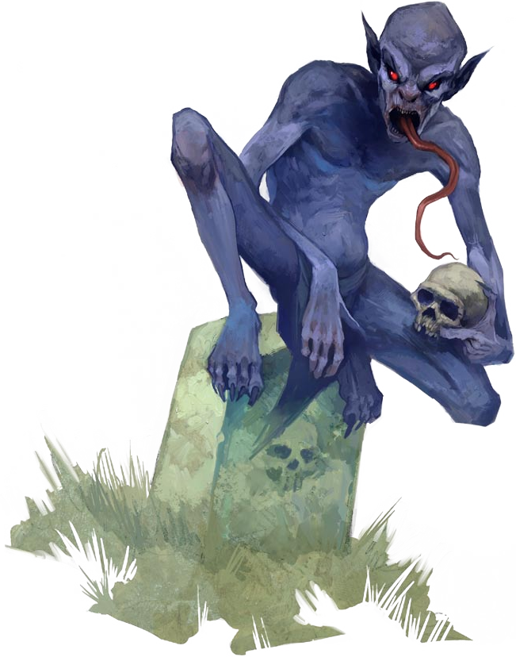

## Quick Navigation

- [ANIMALS](#animals)
  - [Rat Swarm](#rat-swarm)
  - [Wolves](#wolves)
  - [Rhinos](#rhinos)

- [CONSTRUCT](#constructs)
  - [Animated Jacket](#animated-jacket)
  - [Animated Shackles](#animated-shackles)

- [DRAGONS](#dragons)

- [FEY](#fey)

- [HAUNTS](#haunts)
  - [Blood-Writ Names](#blood-writ-names)
  - [Cold Spot](#cold-spot)
  - [Ghostly Brands](#ghostly-brands)
  - [Mouring Maiden](#mouring-maiden)
  - [Slamming Portal](#slamming-portal)

- [HUMANOIDS](#humanoids)
  - [Gibbs](#gibbs)
  - [Orcs](#Orcs)

- [MAGICAL BEASTS](#magical-beasts)
  - [Stirges](#stirges)

- [MONSTER HUMANOIDS](#monster-humanoids)

- [OOZES](#oozes)
  - [Grey Ooze](#grey-ooze)

- [OUTSIDERS](#outsiders)
  - [Devils](#devils)

- [PLANTS](#plants)
  - [Fiendish Leshy](#fiendish-leshy)

- [UNDEAD](#undead)
  - [Burning Skeletons](#burning-skeletons)
  - [Crawling Hands](#crawling-hands)
  - [Ectoplasmic Human](#ectoplasmic)
  - [Flaming Skull](#flaming-skull)
  - [Poltergeist](#poltergeist)
  - [Screaming Heads](#screaming-heads)
  - [Skeletons](#skeletons)
  - [Vampires](#vampires)
  - [Zombies](#zombies)
  - [Ghouls](#ghouls)
    - [Ghasts](#ghasts)

- [VERMIN](#vermin)
  - [Giant Centipedes](#giant-centipedes)
  - [Giant Crab Spiders](#giant-crab-spiders)

---
# Animals
An animal is a living, nonhuman creature, usually a vertebrate with no magical abilities and no innate capacity for language or culture. Animals usually have additional information on how they can serve as companions.

## Rat Swarm

## Wolves

## Rhinos

Rhinoların kalın derileri onlara büyük koruma sağlar. Charge attackları yüksek damagelar çıkarırken, durduklarında vurduğu hasarlar daha düşüktür. 

---
# Construct
A construct is an animated object or artificially created creature.

## Animated Shackles

## Animated Jacket

---
# Dragons

---

# Fey

---

# Haunts

The distinction between a trap and an undead creature blurs when you introduce a haunt—a hazardous region created by unquiet spirits that react violently to the presence of the living. The exact conditions that cause a haunt to manifest vary from case to case—but haunts always arise from a source of terrific mental or physical anguish endured by living, tormented creatures. A single, source of suffering can create multiple haunts, or multiple sources could consolidate into a single haunt. The relative power of the source has little bearing on the strength of the resulting haunt—it’s the magnitude of the suffering or despair that created the haunt that decides its power. Often, undead inhabit regions infested with haunts—it’s even possible for a person who dies to rise as a ghost (or other undead) and trigger the creation of numerous haunts. A haunt infuses a specific area, and often multiple haunted areas exist within a single structure. The classic haunted house isn’t a single haunt, but usually a dozen or more haunted areas spread throughout the structure.

## Blood-Writ Names

## Cold Spot

## Ghostly Brands

## Mouring Maiden

## Slamming Portal

---
# Humanoids
A humanoid usually has two arms, two legs, and one head, or a human-like torso, arms, and a head. Humanoids have few or no supernatural or extraordinary abilities, but most can speak and usually have well-developed societies. They are usually Small or Medium (with the exception of giants). Every humanoid creature also has a specific subtype to match its race, such as human, giant, goblinoid, reptilian, or tengu.

## Gibbs

## Orc

Orklar güç bazlı yaratıkları olsa dahi, aralarında barbarı, savaşçısı, avcısı veya nişancısı olabilir. Rage'e girebilirler ve yaptıkları saldırılar epey güçlüdür.

---
# Magical Beasts
Magical beasts are similar to animals but can have Intelligence scores higher than 2 (in which case the magical beast knows at least one language, but can’t necessarily speak). Magical beasts usually have supernatural or extraordinary abilities, but are sometimes merely bizarre in appearance or habits.

## Stirges

---

# Monster Humanoids

---

# Oozes
An ooze is an amorphous or mutable creature, usually mindless.

## Grey Ooze

---

# Outsiders
An outsider is at least partially composed of the essence (but not necessarily the material) of some plane other than the Material Plane. Some creatures start out as some other type and become outsiders when they attain a higher (or lower) state of spiritual existence.

## Devils

---

# Plants
This type comprises vegetable creatures. Note that regular plants, such as one finds growing in gardens and fields, lack Wisdom and Charisma scores and are not creatures, but objects, even though they are alive.

## Fiendish Leshy

---

# Undead 
Undead are once-living creatures animated by spiritual or supernatural forces.

## Burning Skeletons

## Crawling Hands

## Ectoplasmic Human

## Flaming Skull

## Poltergeist

## Screaming Skulls

## Skeletons

## Vampires

Bazı kötülükler bir anda çökmez insanın üzerine. Önce uzaktan izler. Sonra adını öğrenir.
Ardından sesini, korkularını, hangi saatte yalnız kaldığını, hangi anlarda güçsüz düştüğünü
bilir. Vampirler işte böyledir. Onlar, yalnızca gecede avlanan namevtler değil; sabrı öğrenmiş
açlık, zarafeti kuşanmış çürüme ve insan suretine bürünmüş karanlıktır. Yaşayanların kanıyla
beslenirler, fakat onları korkunç kılan yalnızca bu değildir. Asıl dehşet, çoğu zaman
hayattayken nasıllarsa öyle görünmeleri, hatta bazen ölümün onlara tuhaf bir güzellik,
keskinlik ya da yabani bir asalet katmış olmasıdır.

Bir vampirin yanında hissedilen ilk şey çoğu zaman açık bir tehdit değil, dünyanın düzeninde
beliren ince bir eğriliktir. Gözleri karanlığı olağan insanlardan daha iyi deler; bakışları
yalnızca görüneni değil, gizleneni de yokluyormuş hissi verir. Hareketlerinde ürpertici bir
çeviklik, duruşlarında taş kadar eski bir sükûnet vardır. Güçleri kabadır ama kabalığa ihtiyaç
duymazlar; süratleri hayvansıdır ama hayvanlar gibi acele etmezler. Onlar sessizce yaklaşır,
ikna eder, bekler ve çoğu zaman avlarını parçalamadan önce çoktan çözmüş olurlar. Yalanı,
ikiyüzlülüğü, korkuyu ve tereddüdü okumakta ustadırlar; insan ruhundaki en küçük çatlağı
sezmekte neredeyse doğaüstü bir yetenek taşırlar.

Kana duydukları iştah yalnızca bedensel değildir. Vampir için kan, yaşamın özü, iradenin
sıcaklığı ve faniliğin son parlak hatırasıdır. Kurbanına yalnızca saldırmaz; onu kendine çeker,
tutar, bastırır, sonra usul usul tüketir. Bu yüzden vampirin ziyafeti vahşi bir parçalayıştan çok,
sahiplenmeye benzeyen karanlık bir yakınlıktır. Fakat onların dokunuşunda yalnızca açlık
yoktur; hayatı solduran, insanı bir anda güçsüz ve eksik bırakan mezar soğuğu da vardır.
Bazı kurbanlar yalnızca kan kaybetmiş gibi değil, sanki içlerinden bir parça sökülüp alınmış
gibi çöker. Vampirin yakınında ölüm her zaman bir son gibi gelmez; bazen daha kötü bir
dönüşümün başlangıcı gibi hissedilir.

Çünkü vampir yalnız avlanmaz; hükmeder. Bazıları insanın iradesini gözleriyle ezer,
sesleriyle büker, düşüncesini ağır bir sis gibi kaplayıp onu kendi isteğine yabancılaştırır.
Onların buyruğuna giren kişi kimi zaman bunu emir olarak bile duymaz; sanki kendi aklıyla
vermiş olduğu bir karar sanır. Daha korkuncu, vampirin öldürdüğü bazı kurbanlar mezarda
sessiz kalmaz. Uygun olanlar, birkaç gecenin ardından yeniden doğrulup efendilerinin
gölgesine bağlanabilir; kendilerine ait hayatları sona ermiş, iradeleri başka bir karanlığa
zincirlenmiş hâlde. Böylece bir vampirin çevresinde yalnızca kurbanlar değil, efendisinin yok
oluşuna dek ona boyun eğen hizmetkârlar da birikir.

Onların geceyle olan bağı yalnızca şiirsel değildir; gecenin yaratıkları da çoğu zaman onları
tanır. Sıçanlar, yarasalar, kurtlar ya da bölgenin karanlığına yakışan başka avcı hayvanlar,
sanki eski bir efendinin çağrısını duymuş gibi onlara yönelebilir. Bu yüzden bir vampirin
hüküm sürdüğü topraklarda doğa bile tam anlamıyla masum kalmaz. Mahzenlerde
kemirgenler fazla cesurlaşır, çan kulelerinde yarasalar gereğinden kalabalık toplanır, orman
kenarında kurtların uluması insan sesini andıracak kadar uzun sürer. Bunların hepsi, gecenin
bir yerinde bir iradenin uyanık olduğuna dair uğursuz işaretlerdir.
Vampirlerin sureti de sabit değildir. İstediklerinde yırtıcı bir yarasanın ya da avını sabırla
izleyen bir kurdun biçimine bürünebilirler; daha da kötüsü, yenilgi anında ya da gizlenmeleri
gerektiğinde sis olup aralıklardan, çatlaklardan, kilit altlarından akabilirler. Duman gibi hafifler
ama yok olmazlar; yalnızca bedenin sertliğini bırakıp kötülüğün özüne daha çok benzer hâle
gelirler. Büyük yıkım aldıklarında bile sonları her zaman orada ve hemen gelmez. Çoğu,
dağılan bedenini geride bırakıp mezarına, tabutuna, saklı istirahat yerine dönmeye çalışır.
Sanki ölüm bile onları bir anda kabul etmek istemez; onları yeniden toparlanıp gecenin içine
dönmeleri için kısa bir mühletle geri salar. Bu da vampiri öldürmeyi, sıradan bir canavarı
devirmekten çok daha korkunç ve kişisel bir işe dönüştürür.

Onları tekinsiz yapan şeylerden biri de doğanın bazı işaretleriyle kurdukları bozuk ilişkidir.
Ayna karşısında gerçek bir yüz taşımazlar; yansımaları görünmez, sanki dünyanın parlak
yüzeyi onları tanımayı reddeder. Gölge de onlara tam ait değildir; kimi vampir neredeyse
gölgesizmiş gibi görünür. Duvarlar, kuleler, tavan kirişleri onlar için engel olmaktan çıkabilir;
örümcek gibi dik yüzeylere tutunup yukarı süzülebilirler. Bir odada duruşları bazen heykel
kadar hareketsizdir, sonra göz kırpımı kadar kısa bir anda bambaşka bir yere geçmiş olurlar.
İnsan aklı, o hareketi izlediğini sansa bile sonradan onu düzgünce hatırlayamaz.
Fakat her karanlık kudret gibi onların da kendilerine mahsus sınırları ve aşağılanmaları
vardır. Vampir, sarımsağın ağır kokusundan tiksinir; böyle kokuyla kuşatılmış yerlere
yaklaşmak istemez. Aynalar ve kuvvetle öne sürülen kutsal semboller onları geri iter; bu
nesneler onları yakmasa bile üzerlerinde aşağılayıcı bir itme yaratır, sanki varlıklarının
yalanını yüzlerine vurur. Daha da eski ve daha korkutucu bir kural vardır: Bir vampir, özel bir
eve ya da gerçek anlamda bir yuvaya davetsiz giremez. Kapıyı kırmak başka şeydir, eşiği
geçmek başka. Bir haneye ait o görünmez hak, mezarın ötesinden dönmüş bu açlığa bile bir
an için “buraya kadar” diyebilir. Bu yüzden bazen bir evin en büyük savunması taş duvarı
değil, içeriden verilmemiş tek bir sözdür.

Yine de onların asıl düşmanı insan değil, dünyanın saf kuvvetleridir. Güneş, vampirin taşıdığı
geceyi affetmez; çıplak gün ışığı altında güçleri çöker ve kısa sürede varlıkları dağılmaya
başlar. Akan su da onlar için güvenli değildir; nehir, dere, çağlayan ya da canlı akış taşıyan
su yolları vampir bedenini sanki dünyanın kendisi yıkıyormuş gibi aşındırır. Bu yüzden çoğu
vampir köprüleri, mahzenleri, kapalı geçitleri, kuru yolları ve gölgeyi sever; açık gök ile
hareketli su onların asırlık gururuna karşı yaratılışın sessiz cevabıdır. Onları gerçekten sona
erdirmenin yolları da bu nedenle her zaman vahşi ama ritüel doludur: çaresiz bırakılmış
bedenin kalbine saplanan kazık, koparılan baş ve kutsanmış suyla tamamlanan son hakaret,
mezarın inadını nihayet susturabilir.

Birçok vampir bu yüzden kendine bir sığınak, bir tabut, bir geri dönüş noktası hazırlar. Çünkü
ne kadar kudretli olursa olsun, gece yaratığı da yenilgi ihtimalini tanır. Malikânesinin en gizli
odası, aile mezarlığının altındaki taş hücre, unutulmuş bir şapelin mahzeni ya da toprağın
derinindeki işlemeli bir sanduka… bunlar yalnızca barınak değil, vampirin ikinci kalbidir.
Oraya çekildiğinde toparlanır, yeniden biçim kazanır, sonra hıncıyla birlikte geri döner. Bu
yüzden vampir avı yalnızca yaratığı bulmak değil, onun döneceği yeri de keşfetmek
demektir; aksi hâlde gece, mağlup edilmiş sandığınız kötülüğü ertesi akşam yeniden
kapınıza getirebilir.

Ve bütün bu uğursuz özelliklerine rağmen vampiri asıl dehşet verici yapan, çoğu zaman hâlâ
konuşabilmesi, düşünebilmesi, hatta kimi şeyleri takıntı derecesinde sevebilmesidir. Zekâları
keskindir, sezgileri güçlüdür, bakışları delici, sözleri aldatıcı derecede yumuşak olabilir. Uzun
çağların birikimi onlara yalnızca bilgi değil, kibir de verir. Kendilerini ölümlülerin üstünde
görürler; ama aynı anda yaşayanların sıcaklığına, değişebilirliğine ve hâlâ akan zamana
karşı derin bir haset taşırlar. İşte bu yüzden bir vampir yalnızca mezardan çıkmış bir avcı
değildir. O, canlı olana özlem duyan ama artık ona ait olamayan bir lanettir; güzel yüzlü bir
açlık, sabırlı bir felaket, davet bekleyen bir kabus, adıyla çağırdığı insanı önce seyreden,
sonra isteyen, en sonunda da kendi sessiz gecesine katmaya çalışan konuşan bir mezardır

## Zombies

## Ghouls

Uzun ve keskin dişlere sahip bu insansı yaratığın soluk teni, açlıktan kurumuş iskeleti üzerinde sıkıca gerilmiştir.

- Yakın Dövüş: Isırık (hastalık ve felç), 2 Pençe (felç)
- Özel Saldırılar: Felç
- Savunma Yetenekleri: Channel Resistance
- Can Puanı: Oldukça düşük
- Hastalık: Gulyabani Ateşi

Gulyabaniler, köyleri ve mezarlıkları mesken tutan, cesetlerle beslenen undead yaratıklardır. Genellikle sürüler halinde bulunurlar.

## Ghasts

Yakın Dövüş: Isırık (hastalık), 2 Pençe
Özel Saldırılar: Felç, İğrenç Koku (Stench)
Bu yaratıklar, alt sınıf akrabalarına (sıradan gulyabanilere) fiziksel olarak çok benzeseler de çok daha ölümcül ve kurnazdırlar. Gastlar ya kendi türlerinden oluşan sürüler halinde dolaşır ya da sıradan gulyabani gruplarına liderlik ederler. Bu yaratıkların etrafını saran ölüm ve çürüme kokusu dayanılmaz boyuttadır ve yaklaşanı hasta eder.

---

# Vermin
This type includes insects, arachnids, other arthropods, worms, and similar invertebrates.

## Giant Centipedes

## Giant Crab Spiders

